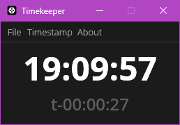

# timekeeper

||
|---|

Large display, widget-like clock application with rich keyboard support. 
Remake of an older python script I used to use for time management.

## Licence

All authored source code is licenced under [apache-2.0](LICENCE.txt) ([web copy](https://www.apache.org/licenses/LICENSE-2.0)).

Fonts (Open Sans [bold](src/font/OpenSans-Bold.ttf), [medium](src/font/OpenSans-Medium.ttf) and [light](src/font/OpenSans-Light.ttf)) included with codebase and with compiled program under OFL. Full licence details are included within [`opensans-ofl.txt`](src/font/opensans-ofl.txt) next to files, as provided with [the source of the font](https://github.com/googlefonts/opensans).